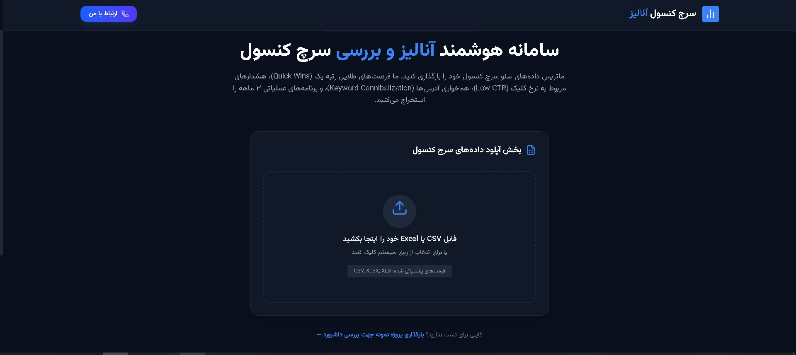
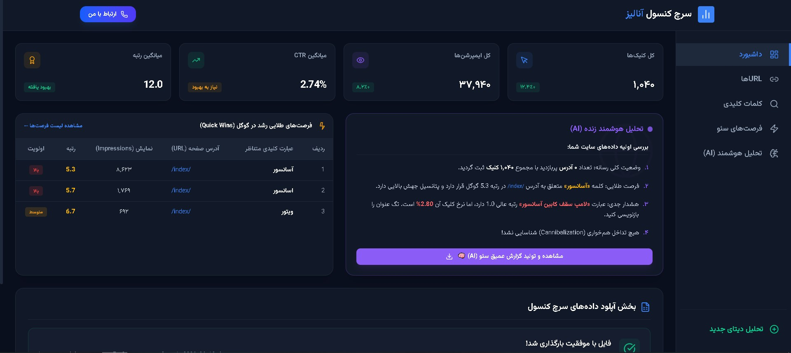
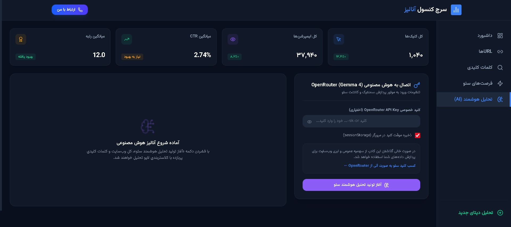

<div align="center">


<br/><br/>

# 📊 سرچ کنسول آنالیز
### AI-Powered SEO Analytics Dashboard

**یک داشبورد حرفه‌ای و هوشمند برای تحلیل داده‌های Google Search Console**

[🚀 مشاهده داشبورد](https://your-demo-link.vercel.app)

<br/>



</div>

---

## ✨ ویژگی‌های اصلی

| قابلیت | توضیح |
|---|---|
| 📁 **آپلود فایل** | پشتیبانی از فرمت‌های CSV و Excel (خروجی سرچ کنسول) |
| ⚡ **Quick Win URLs** | شناسایی خودکار URLهایی با رتبه ۴ تا ۱۰ برای بهینه‌سازی فوری |
| ⚠️ **هشدار CTR پایین** | تشخیص صفحاتی با رتبه خوب اما نرخ کلیک پایین |
| 🤖 **تحلیل هوشمند AI** | گزارش متنی جامع با استریم زنده کلمه به کلمه |
| 📄 **گزارش HTML** | دانلود گزارش کامل شامل نمودارها، جداول و تحلیل AI |
| 🌙 **Dark Theme** | طراحی تیره و حرفه‌ای با فونت Anjoman |
| 🔐 **بدون هزینه** | API Key توسط کاربر وارد می‌شود — هیچ هزینه‌ای برای توسعه‌دهنده ندارد |

---

## 🖥️ پیش‌نمایش

<div align="center">

### صفحه آپلود فایل


### داشبورد اصلی


### تحلیل هوشمند


</div>

---

## 🛠️ تکنولوژی‌ها

```
Frontend         → React 18 + Vite 5
Styling          → Tailwind CSS
Charts           → Recharts
CSV Parser       → PapaParse
Excel Parser     → SheetJS (xlsx)
AI Integration   → OpenRouter API (google/gemma-4-31b-it:free)
Font             → Anjoman (فارسی)
Icons            → Lucide React
Deploy           → Vercel
```

---

## 🚀 راه‌اندازی سریع

### پیش‌نیازها

- Node.js نسخه ۱۸ یا بالاتر
- npm یا yarn
- یک API Key رایگان از [OpenRouter](https://openrouter.ai/keys)

### نصب و اجرا

```bash
# کلون کردن پروژه
git clone https://github.com/hamidrezataghipour/search-console-analyzer.git

# رفتن به پوشه پروژه
cd search-console-analyzer

# نصب پکیج‌ها
npm install

# اجرا در حالت توسعه
npm run dev
```

پروژه روی آدرس `http://localhost:5173` در دسترس است.

### ساخت نسخه نهایی (Build)

```bash
# ساخت فایل‌های نهایی
npm run build

# پیش‌نمایش نسخه Build شده
npm run preview
```

خروجی نهایی در پوشه `dist/` قرار می‌گیرد و آماده آپلود روی هر هاست است.

---

## 📖 راهنمای استفاده

**گام اول — آپلود فایل**

وارد [Google Search Console](https://search.google.com/search-console) شو:
`Performance → Export → Download CSV`

سپس فایل را در داشبورد آپلود کن.

**گام دوم — بررسی نمودارها**

چهار نمودار اصلی به صورت آکاردون نمایش داده می‌شوند:
- 📊 کلیک‌ها (Clicks)
- 👁️ نمایش‌ها (Impressions)
- 🎯 نرخ کلیک (CTR)
- 🏆 میانگین رتبه (Position)

**گام سوم — تحلیل هوشمند**

به بخش **تحلیل هوشمند** برو، API Key رایگان خود را از [OpenRouter](https://openrouter.ai/keys) وارد کن و روی «شروع تحلیل» کلیک کن.

هوش مصنوعی Gemma 4 31B به صورت زنده (Streaming) گزارش فارسی کامل تولید می‌کند.

**گام چهارم — دانلود گزارش**

پس از اتمام تحلیل، روی «دانلود گزارش کامل HTML» کلیک کن. فایل HTML دریافتی شامل تمام نمودارها، جداول و تحلیل AI است و به صورت آفلاین قابل مشاهده است.

---

## 📁 ساختار پروژه

```
search-console-analyzer/
│
├── public/
│   └── favicon.ico
│
├── src/
│   ├── components/
│   │   ├── Layout/
│   │   │   ├── Header.jsx          # هدر با لوگو
│   │   │   ├── Sidebar.jsx         # منوی عمودی
│   │   │   └── Footer.jsx          # فوتر با لینک‌های شبکه اجتماعی
│   │   │
│   │   ├── Upload/
│   │   │   └── FileUpload.jsx      # آپلود Drag & Drop
│   │   │
│   │   ├── Dashboard/
│   │   │   ├── Overview.jsx        # کارت‌های آمار کلی
│   │   │   ├── UrlTable.jsx        # جدول URLها
│   │   │   └── KeywordTable.jsx    # جدول کلمات کلیدی
│   │   │
│   │   ├── Charts/
│   │   │   ├── ChartsSection.jsx   # نمودارهای آکاردون
│   │   │   └── ChartWrapper.jsx    # رفع مشکل ResizeObserver
│   │   │
│   │   ├── Insights/
│   │   │   ├── QuickWins.jsx       # فرصت‌های طلایی
│   │   │   └── LowCTRAlert.jsx     # هشدار CTR پایین
│   │   │
│   │   └── AI/
│   │       ├── AIAnalysis.jsx      # تحلیل هوشمند + Stream
│   │       └── ReportGenerator.jsx # تولید گزارش HTML
│   │
│   ├── utils/
│   │   ├── fileParser.js           # پارس CSV و Excel
│   │   ├── seoAnalyzer.js          # الگوریتم‌های تحلیل سئو
│   │   └── reportGenerator.js      # ساخت گزارش HTML
│   │
│   ├── App.jsx
│   ├── main.jsx
│   └── index.css
│
├── index.html
├── tailwind.config.js
├── vite.config.js
└── package.json
```

---

## 🤖 مدل هوش مصنوعی

این پروژه از مدل **`google/gemma-4-31b-it:free`** از طریق OpenRouter استفاده می‌کند.

| مشخصه | مقدار |
|---|---|
| سازنده | Google |
| پارامترها | ۳۱ میلیارد |
| Context Window | ۲۶۲K توکن |
| هزینه | 🆓 کاملاً رایگان |
| محدودیت | ۲۰۰ درخواست در روز |

---

## 🌐 استقرار روی Vercel

```bash
# نصب Vercel CLI
npm i -g vercel

# دیپلوی
vercel --prod
```

یا مستقیم از طریق [vercel.com](https://vercel.com) با اتصال به ریپازیتوری گیت‌هاب.

---

## 🔒 امنیت و حریم خصوصی

- هیچ داده‌ای روی سرور ذخیره نمی‌شود
- تمام پردازش‌ها در مرورگر کاربر انجام می‌شود
- API Key فقط در حافظه موقت (Session) نگهداری می‌شود
- فایل‌های آپلود شده هرگز ارسال نمی‌شوند

---

## 🗺️ نقشه راه (Roadmap)

- [x] آپلود CSV و Excel
- [x] نمودارهای تعاملی
- [x] الگوریتم Quick Win
- [x] تحلیل هوشمند با Streaming
- [x] گزارش HTML قابل دانلود
- [ ] مقایسه چند فایل (چند ماه)
- [ ] نمودار تغییرات زمانی
- [ ] فیلتر بر اساس Device و Country
- [ ] اتصال مستقیم به Search Console API

---

---

## 📄 لایسنس

این پروژه تحت لایسنس [MIT](LICENSE) منتشر شده است.

---

<div align="center">

ساخته شده با ❤️ توسط **[حمید رضا تقی پور](https://linkedin.com/in/hamidrezataghipour)**
[](https://github.com/hamidrezataghipour)
[](https://linkedin.com/in/hamidrezataghipour)

<br/>

⭐ اگر این پروژه برات مفید بود، یک Star بده!

</div>
